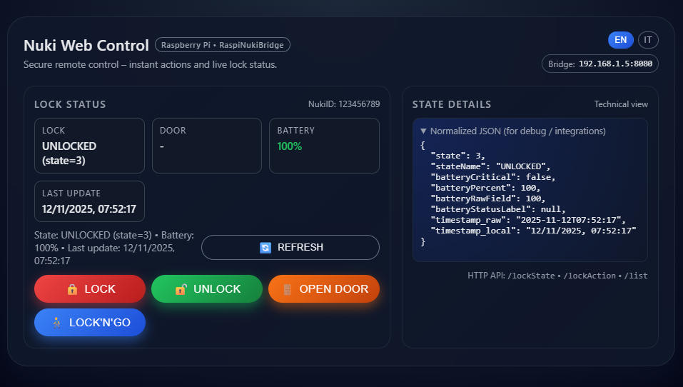

# Nuki Web Control (RaspiNukiBridge UI)

<p align="center">
  <a href="https://github.com/lmerega/nuki-web-control/stargazers">
    
  </a>
  <a href="https://github.com/lmerega/nuki-web-control/issues">
    
  </a>
  
  
  
  
  
  <br>
  <a href="https://github.com/dauden1184/RaspiNukiBridge">
    
  </a>
</p>

## Screenshot



A small Flask web UI to control a Nuki Smart Lock via a [RaspiNukiBridge](https://github.com/dauden1184/RaspiNukiBridge) instance.

The app:

- Calls the RaspiNukiBridge HTTP API (`/lockState`, `/lockAction`, `/list`)
- Shows live lock status (lock state, door state, battery, timestamp)
- Provides buttons for **Lock**, **Unlock**, **Unlatch (open door)** and **Lock'n'Go**
- Normalizes the raw state JSON for debugging / integrations
- Supports **English** and **Italian** UI with a language switcher

> ⚠️ This project is intended as an example / personal tool.  
> It has **no authentication** by default. Do **not** expose it directly to the public internet.

---

## Requirements

- Python 3.9+ (recommended)
- A running **[RaspiNukiBridge](https://github.com/dauden1184/RaspiNukiBridge)** instance (e.g. on a Raspberry Pi)
- A working Nuki lock configured in the bridge

Install Python dependencies with:

```bash
pip install -r requirements.txt
```

---

## Configuration

All configuration is handled via `config.yaml`.

An example file is provided as `config_example.yaml`:

```yaml
bridge:
  host: "127.0.0.1"
  port: 8080

nuki:
  token: "CHANGE_ME"
  id: 123456789
  device_type: 0

web:
  port: 5000
  language: "en"
```

### Setup steps

1. Copy the example configuration:

   ```bash
   cp config_example.yaml config.yaml
   ```

2. Edit `config.yaml` and set:

   - `bridge.host` and `bridge.port` to your RaspiNukiBridge address
   - `nuki.token` to the `server.token` from your Nuki / bridge configuration
   - `nuki.id` to the `nukiId` returned by the `/list` endpoint
   - `nuki.device_type` (usually `0` for Smart Lock)
   - `web.port` for the Flask HTTP port
   - `web.language` to `"en"` or `"it"` for the default UI language

3. Make sure `config.yaml` is **ignored by Git** (see `.gitignore`) and never committed.

---

## Running the app

From the project directory:

```bash
python app.py
```

By default, the app listens on:

```text
http://0.0.0.0:<web.port>
```

For example, if `web.port` is `5000`:

```text
http://raspberrypi:5000/
```

Listening on `0.0.0.0` makes the app reachable from your local network and/or VPN (depending on your routing / firewall).

---

## Usage

Open the web UI in your browser:

```text
http://<your-host>:<web.port>/
```

You will see:

- **Lock state** card:
  - Lock state
  - Door state
  - Battery (with color-coded level and critical flag)
  - Last update timestamp (converted to Europe/Rome time)
- **Action buttons**:
  - **Lock**
  - **Unlock**
  - **Open door** (Unlatch)
  - **Lock'n'Go**
- **State details** card:
  - Normalized JSON view (for debugging / integration with other systems)

The UI calls:

- `GET /api/state` → calls bridge `/lockState` and returns JSON
- `POST /action/<cmd>` → calls bridge `/lockAction` with the appropriate `action` code

---

## HTTP API overview

Internally, the app talks to the **[RaspiNukiBridge](https://github.com/dauden1184/RaspiNukiBridge)**:

- `GET http://<bridge.host>:<bridge.port>/lockState`  
  Query params: `nukiId`, `deviceType`, `token`

- `GET http://<bridge.host>:<bridge.port>/lockAction`  
  Query params: `nukiId`, `deviceType`, `action`, `token`

Action mapping:

- `1` → unlock  
- `2` → lock  
- `3` → unlatch (open door)  
- `4` → lock'n'go  
- `5` → lock'n'go + unlatch (not wired by default, but easy to add)

---

## Language support (English / Italian)

The UI is fully localized in **English** and **Italian**.

### Default language

The default language is defined in `config.yaml`:

```yaml
web:
  language: "en"  # or "it"
```

### Runtime language switching

The current language can be changed at runtime in two ways:

1. **URL parameter**

   - Force English:  
     `http://<host>:<port>/?lang=en`
   - Force Italian:  
     `http://<host>:<port>/?lang=it`

2. **Language switcher in the UI**

   At the top right you will find a small language switcher:

   - 🇬🇧 **EN**
   - 🇮🇹 **IT**

   Clicking a button:

   - updates the `?lang=...` query parameter
   - reloads the page
   - keeps the language consistent for:
     - the main page
     - actions (`/action/...`)
     - `/api/state` calls

The actual UI strings are defined in the `STRINGS` dictionary in `app.py`.

---

## Adding a new language

The app uses a simple in-code dictionary for i18n, so adding a new language is straightforward.

1. **Edit `app.py` and extend the `STRINGS` dict**

   Find:

   ```python
   STRINGS = {
       "en": { ... },
       "it": { ... },
   }
   ```

   Add a new entry, for example for German:

   ```python
   STRINGS["de"] = {
       "html_lang": "de",
       "subtitle": "Secure remote control – instant actions and live lock status. (DE)",
       "bridge_label": "Bridge:",
       "error_keyword": "Error",
       # ...copy all keys from "en" or "it" and translate them...
   }
   ```

   Make sure the new language block defines **all** the keys used by the template and JS  
   (you can copy the `"en"` block and translate value by value).

2. **Add a button in the language switcher in the HTML template**

   In the header, there is a block like:

   ```html
   <div class="lang-switcher" aria-label="Language">
     <button type="button" class="lang-btn" data-lang="en">
       <span class="flag">🇬🇧</span>
       <span>{{ ui.lang_en_label }}</span>
     </button>
     <button type="button" class="lang-btn" data-lang="it">
       <span class="flag">🇮🇹</span>
       <span>{{ ui.lang_it_label }}</span>
     </button>
   </div>
   ```

   Add another button, for example:

   ```html
   <button type="button" class="lang-btn" data-lang="de">
     <span class="flag">🇩🇪</span>
     <span>DE</span>
   </button>
   ```

3. **(Optional) Set the default language in `config.yaml`**

   ```yaml
   web:
     language: "de"
   ```

   If present and valid, this will be the default language when `?lang=` is not specified.

After these steps, the new language will be available both via `?lang=de` in the URL and via the new flag button in the UI.

---

## Systemd service (optional)

On a Linux host (e.g. Raspberry Pi) you can run the app as a systemd service.

This repository includes an example unit file:

```text
nukiweb.service.example
```

It is suitable for a typical Raspberry Pi setup where the project lives in `/home/pi/nuki_web` and the virtualenv is `.venv`.

To use it on your system, copy it as a systemd unit:

```bash
sudo cp nukiweb.service.example /etc/systemd/system/nukiweb.service
sudo systemctl daemon-reload
sudo systemctl enable nukiweb.service
sudo systemctl start nukiweb.service
```

Then check the status with:

```bash
sudo systemctl status nukiweb.service
```

If your user or paths differ, adjust `nukiweb.service.example` before copying.

---

## Security notes

This app **does not implement authentication** by itself.

Recommended:

- Run it **behind a VPN** or behind a reverse proxy with authentication.
- Use HTTPS if you expose it through a reverse proxy (Nginx, Caddy, Traefik, …).
- Do **not** expose it directly to the public internet on `0.0.0.0:<port>` without proper access control.
- Keep your `config.yaml` private and never commit it to source control.

---

## License

This project is licensed under the MIT License – see the `LICENSE` file for details.
